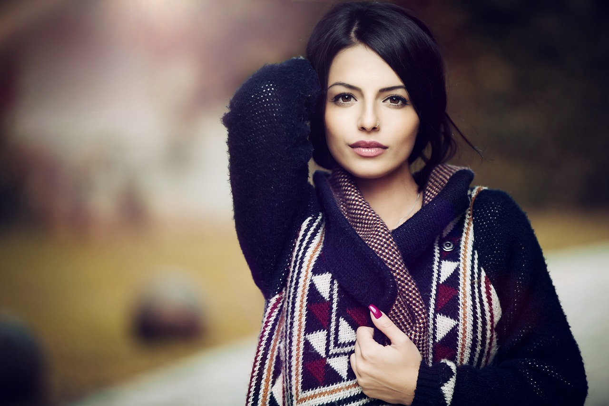
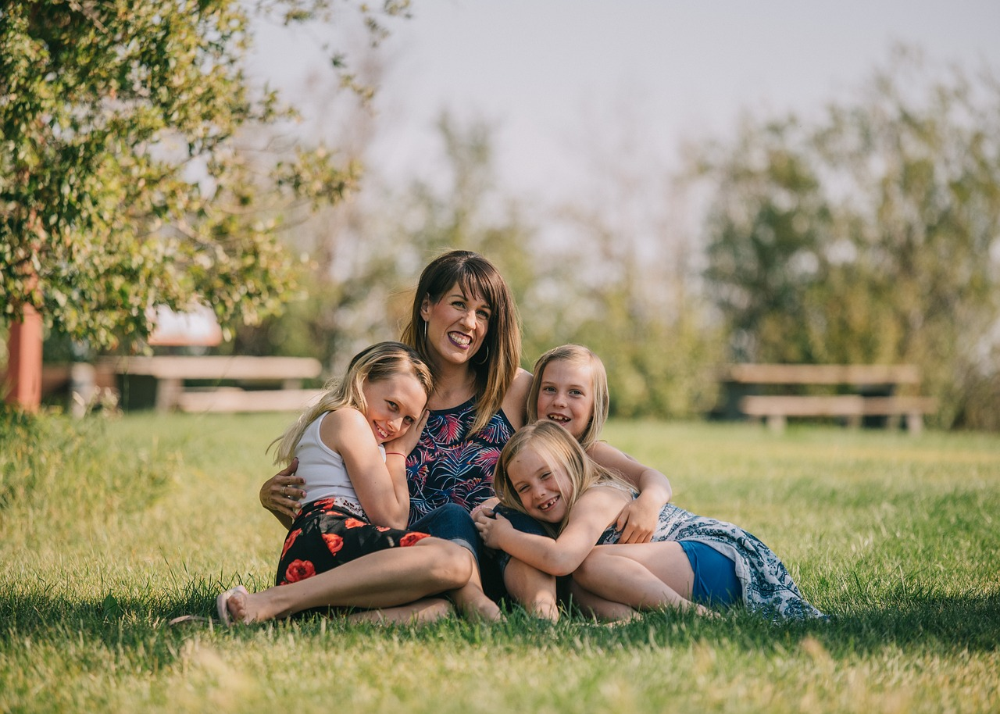

# autocropface
Face auto cropping with yolo and opencv

This module combines YOLO object detection and OpenCV image processing, aiming to quickly and automatically crop individuals in images and provide a positional offset feature. 
The output images are square, and the aesthetics of cropping are subjective. 
Based on the cropping and scaling settings, the typical output consists of 9 images commonly.

Please note that if facial features are dispersed, the algorithm retains the central facial region near the square boundary, emphasizing the distance between the central facial region and the square boundary to preserve facial proportions in the image to the greatest extent possible.

usage

```bash
python main.py --cfgpath "path/to/your/config/file.cfg" --weightpath "path/to/your/weights/file.weights" --cropmode "face" --CONFIDENCE_THRESHOLD 0 --NMS_THRESHOLD 0.2 --offset 0 0 0 0
```

Parameter Descriptions

1. cfgpath,weightpath: Model path

2. cropmode: Cropping mode (type of detection class, currently only face mode).

3. CONFIDENCE_THRESHOLD: Confidence threshold for YOLO object detection.

4. NMS_THRESHOLD: Non-Maximum Suppression (NMS) threshold for YOLO object detection.

5. offset: List of floating-point numbers representing top, bottom, left, and right offsets.

Notes

1. The core facial position will be determined based on YOLO detection results.

2. When facial features are dispersed, only the central facial region is retained.

3. Output images are square.

Examples

Input: one face in a image
<table>
  <tr>
    <td>
      
    </td>
    <td>
      <br>
      <br>
      <br>
      <br>
      <br>
    </td>
    <td>
      <br>
      <br>
      <br>
      <br>
      <br>
    </td>
  </tr>
</table>

Input: mutiple faces in a image
<table>
  <tr>
    <td>
      
    </td>
    <td>
      <br>
      <br>
      <br>
      <br>
      <br>
    </td>
    <td>
      <br>
      <br>
      <br>
      <br>
      <br>
    </td>
  </tr>
</table>


Author: Fierens
